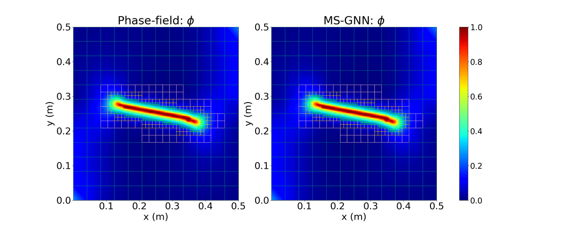
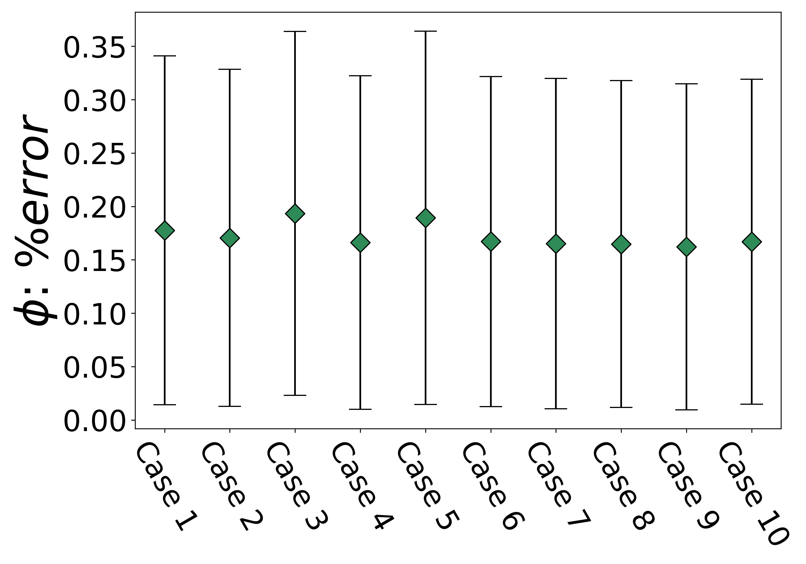
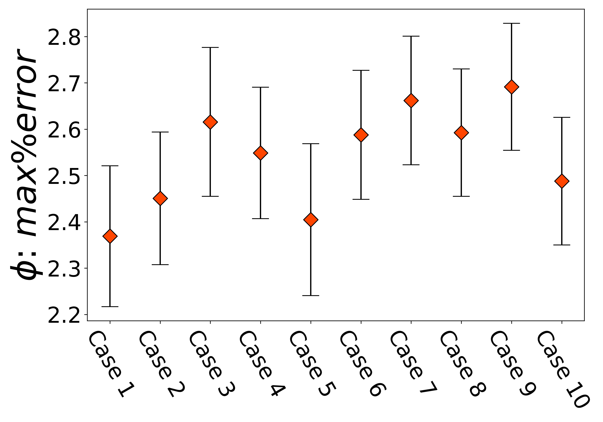
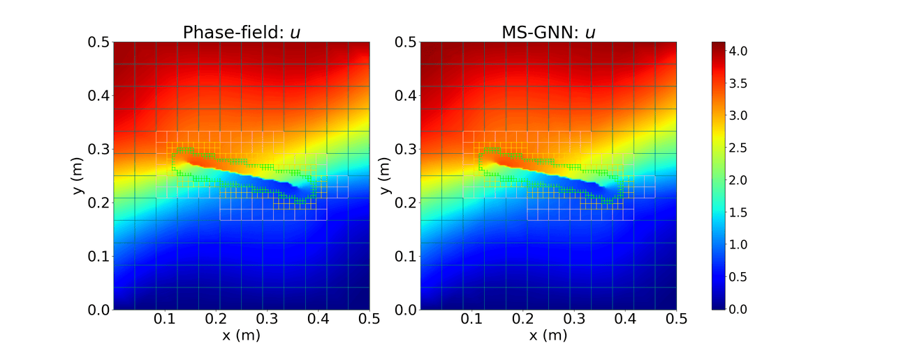
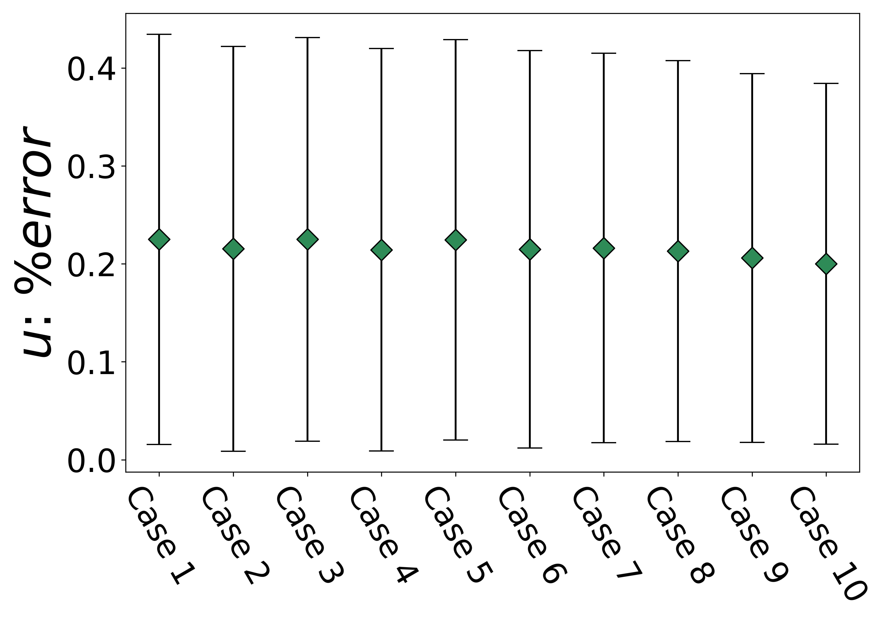
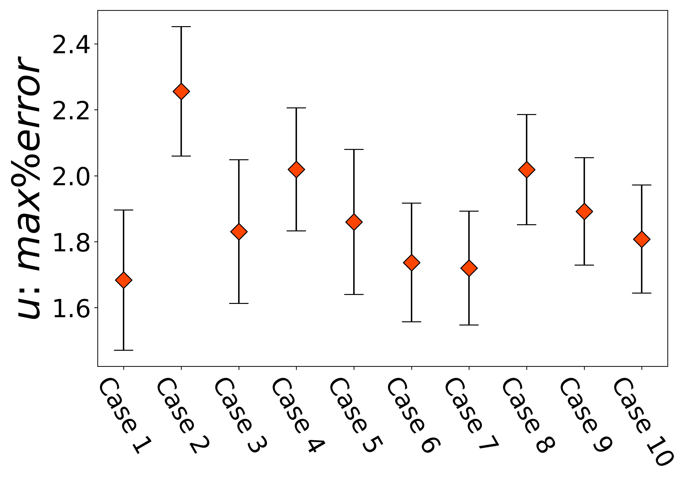

# Mode-I and Mode-II Loading

## Phase field versus Multiscale GNN - Predicted damage field 

## Average & Maximum error of predicted damage field for entire test dataset

## Phase field versus Multiscale GNN - Predicted x-displacement field 

## Maximum error of predicted x-displacement field for entire test dataset

## Phase field versus Multiscale GNN - Predicted y-displacement field 

## Maximum error of predicted y-displacement field for entire test dataset

