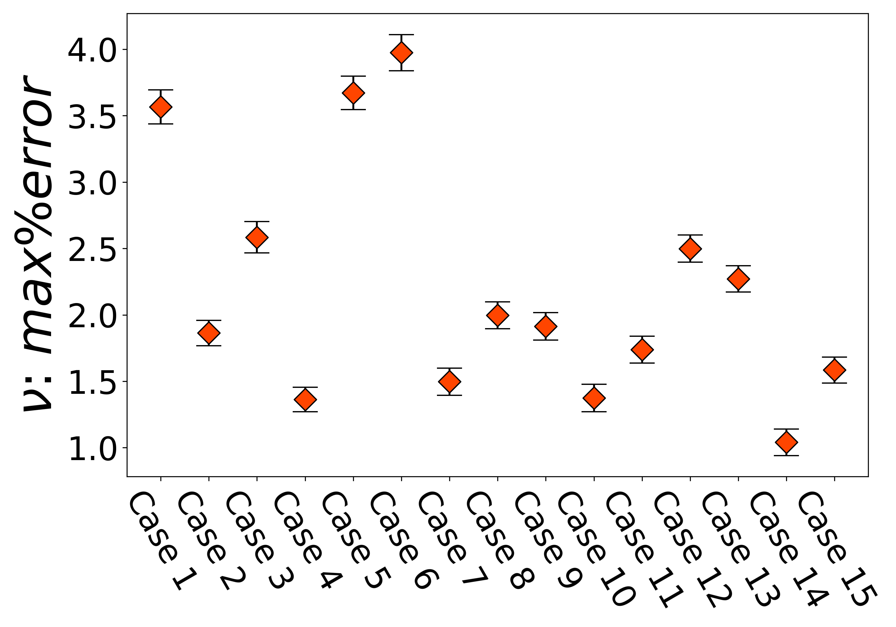

# Right Edge crack cases

## Phase field versus Multiscale GNN - Predicted damage field 

## Maximum error of predicted damage field for entire test dataset

## Phase field versus Multiscale GNN - Predicted x-displacement field 

## Maximum error of predicted x-displacement field for entire test dataset

## Phase field versus Multiscale GNN - Predicted y-displacement field 

## Maximum error of predicted y-displacement field for entire test dataset

